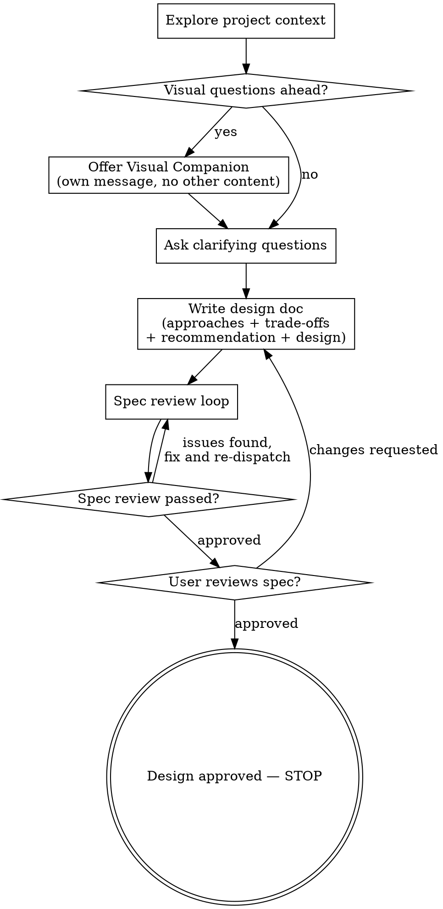

# Brainstorming Ideas Into Designs

Help turn ideas into fully formed designs and specs through natural collaborative dialogue.

Start by understanding the current project context, then ask questions one at a time to refine the idea. Once you understand what you're building, write the design document — approaches, trade-offs, recommendation, design — and get user approval on the file.

<HARD-GATE>
Do NOT invoke any implementation skill, write any code, scaffold any project, or take any implementation action until you have written a design document and the user has approved it. This applies to EVERY project regardless of perceived simplicity. An approved design is where this skill ends, not where implementation begins — wait for the user to ask.
</HARD-GATE>

## Anti-Pattern: "This Is Too Simple To Need A Design"

Every project goes through this process. A todo list, a single-function utility, a config change — all of them. "Simple" projects are where unexamined assumptions cause the most wasted work. The design doc can be short (a few sentences per section, and the approaches reduced to two for truly simple projects), but you MUST write it and get approval.

## Checklist

You MUST create a task for each of these items and complete them in order:

1. **Explore project context** — check files, docs, recent commits
2. **Offer visual companion** (if topic will involve visual questions) — this is its own message, not combined with a clarifying question. See the Visual Companion section below.
3. **Ask clarifying questions** — one at a time, understand purpose/constraints/success criteria
4. **Write design doc** — save to `docs/YYYY-MM-DD-<topic>-design.md`. It carries the 2-3 approaches with their pros and cons, your recommendation, and the design itself
5. **Spec review loop** — dispatch spec-document-reviewer subagent with precisely crafted review context (never your session history); fix issues and re-dispatch until approved (max 5 iterations, then surface to human)
6. **User reviews written spec** — ask user to review the spec file; revise and re-review until they approve

## Process Flow

**The terminal state is an approved design document.** Once the user approves the spec, this skill is done — stop and report the path. Do NOT invoke frontend-design, mcp-builder, or any other implementation skill, and do NOT start implementing. If the user wants the design built, that is a new request from them.

## The Process

**Understanding the idea:**

- Check out the current project state first (files, docs, recent commits)
- Before asking detailed questions, assess scope: if the request describes multiple independent subsystems (e.g., "build a platform with chat, file storage, billing, and analytics"), flag this immediately. Don't spend questions refining details of a project that needs to be decomposed first.
- If the project is too large for a single spec, help the user decompose into sub-projects: what are the independent pieces, how do they relate, what order should they be built? Then brainstorm the first sub-project through the normal design flow. Each sub-project gets its own spec.
- For appropriately-scoped projects, ask questions one at a time to refine the idea
- Prefer multiple choice questions when possible, but open-ended is fine too
- Only one question per message - if a topic needs more exploration, break it into multiple questions
- Focus on understanding: purpose, constraints, success criteria

**Writing the design doc:**

Once the clarifying questions are answered, go **straight to the document**. Do not walk the user through approaches or design sections in chat first — the approaches, the trade-offs, the recommendation and the design all live in the file, and the file is what the user reviews.

The document must contain, in this order:

1. **Problem and context** — what is being built and why, in the user's own framing. The constraints and success criteria that came out of the clarifying questions go here, written down explicitly.
2. **Approaches considered** — 2-3 genuinely different approaches, each with **Pros** and **Cons**. Different means different in kind, not the same approach with a setting changed: if two approaches fail the same way, cost the same and take the same effort, they are one approach with two names. Cons must be real — an approach with no downside means you stopped looking. Include the cost that shows up later, not just at setup.
3. **Recommendation** — one approach, the reason it wins for *this* problem, and what fact would flip the decision to another approach.
4. **The design** — of the recommended approach only. Cover architecture, components, data flow, error handling, testing. Scale each section to its complexity: a few sentences if straightforward, up to 200-300 words if nuanced.

Comparing approaches on 3-4 axes that actually decide it here (effort, cost, how it fails, how hard it is to change later) is worth a small table. A generic feature grid is not.

If something turns out to be unclear while writing, stop and ask rather than guessing in the document.

**Design for isolation and clarity:**

- Break the system into smaller units that each have one clear purpose, communicate through well-defined interfaces, and can be understood and tested independently
- For each unit, you should be able to answer: what does it do, how do you use it, and what does it depend on?
- Can someone understand what a unit does without reading its internals? Can you change the internals without breaking consumers? If not, the boundaries need work.
- Smaller, well-bounded units are also easier for you to work with - you reason better about code you can hold in context at once, and your edits are more reliable when files are focused. When a file grows large, that's often a signal that it's doing too much.

**Working in existing codebases:**

- Explore the current structure before proposing changes. Follow existing patterns.
- Where existing code has problems that affect the work (e.g., a file that's grown too large, unclear boundaries, tangled responsibilities), include targeted improvements as part of the design - the way a good developer improves code they're working in.
- Don't propose unrelated refactoring. Stay focused on what serves the current goal.

## After the Design

**Documentation:**

- Write the design (spec) to `docs/YYYY-MM-DD-<topic>-design.md`
  - (User preferences for spec location override this default)
- Use elements-of-style:writing-clearly-and-concisely skill if available

**Spec Review Loop:**
After writing the spec document:

1. Dispatch spec-document-reviewer subagent (see spec-document-reviewer-prompt.md)
2. If Issues Found: fix, re-dispatch, repeat until Approved
3. If loop exceeds 5 iterations, surface to human for guidance

**User Review Gate — the last step:**
After the spec review loop passes, ask the user to review the written spec:

> "Spec written to `<path>`. Please review it and let me know if you want to make any changes."

Wait for the user's response. If they request changes, make them and re-run the spec review loop. Once the user approves, **the skill is finished** — report the path and stop. Do not offer to implement it, and do not start.

## Key Principles

- **One question at a time** - Don't overwhelm with multiple questions
- **Multiple choice preferred** - Easier to answer than open-ended when possible
- **YAGNI ruthlessly** - Remove unnecessary features from all designs
- **Explore alternatives** - Always write up 2-3 approaches with pros and cons, then recommend one. Never a single approach, never a menu with no recommendation
- **The document is the deliverable** - approaches, trade-offs and design go in the file, not in chat. The user reviews the file
- **Be flexible** - Go back and clarify when something doesn't make sense

## Visual Companion

A browser-based companion for showing mockups, diagrams, and visual options during brainstorming. Available as a tool — not a mode. Accepting the companion means it's available for questions that benefit from visual treatment; it does NOT mean every question goes through the browser.

**Offering the companion:** When you anticipate that upcoming questions will involve visual content (mockups, layouts, diagrams), offer it once for consent:
> "Some of what we're working on might be easier to explain if I can show it to you in a web browser. I can put together mockups, diagrams, comparisons, and other visuals as we go. This feature is still new and can be token-intensive. Want to try it? (Requires opening a local URL)"

**This offer MUST be its own message.** Do not combine it with clarifying questions, context summaries, or any other content. The message should contain ONLY the offer above and nothing else. Wait for the user's response before continuing. If they decline, proceed with text-only brainstorming.

**Per-question decision:** Even after the user accepts, decide FOR EACH QUESTION whether to use the browser or the terminal. The test: **would the user understand this better by seeing it than reading it?**

- **Use the browser** for content that IS visual — mockups, wireframes, layout comparisons, architecture diagrams, side-by-side visual designs
- **Use the terminal** for content that is text — requirements questions, conceptual choices, tradeoff lists, A/B/C/D text options, scope decisions

A question about a UI topic is not automatically a visual question. "What does personality mean in this context?" is a conceptual question — use the terminal. "Which wizard layout works better?" is a visual question — use the browser.

If they agree to the companion, read the detailed guide before proceeding:
`skills/brainstorming/visual-companion.md`
