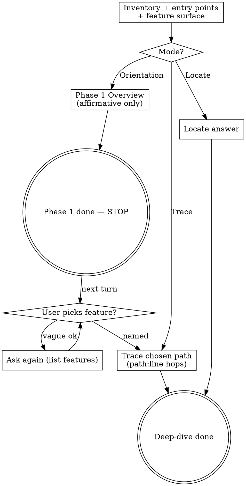

# Codebase Onboarding

Build a mental model from **source you opened**, not docs or framework autopilot. Every factual claim needs a `` `path:line` ``. Read-only: describe the system; don't review or improve it.

## Anchor rule

Full repo-relative paths. Label evidence:

| Tier | Meaning | Phrase |
|---|---|---|
| **Read** | Opened that code | State plainly with `` `path:line` `` |
| **Wired** | Saw registration/import only | Say both halves; name what was not read |
| **Not inspected** | Exists, skipped | List under Coverage |

**Docs are leads, not evidence.** Confirm in code; attribute unconfirmed doc claims to their path. Do not pad Overview with what the repo lacks.

## Modes

| Question | Mode | Deliver |
|---|---|---|
| "What is this repo?" / "where do I start?" | **Orientation** | Phase 1 → ask feature → Phase 2 |
| "How does login work?" | **Trace** | One path, every hop (skip Phase 1 ask) |
| "Where is rate limiting?" | **Locate** | Owning file + evidence — not a full orientation |

## Process Flow



## Checklist

1. **Inventory** — top-level + manifests (`package.json`, `pyproject.toml`, …), not README. Classify app/service/lib/CLI/monorepo. Skip `node_modules`/`dist`/generated. Unfamiliar stack → `references/entry-points.md`. ~10–25 files for Phase 1.
2. **Entry points + features** — 1–5 starters (trigger / wires / hand-off). Feature list from routes, commands, exports, workers; group **per package** if multi-service. Run/use from real scripts only.
3. **Orientation HARD-GATE** — deliver Phase 1, **stop**. No deep-dive same turn. Vague "ok" → re-ask list; do not pick for them. Skip gate on Trace/Locate.
4. **Trace** — after pick (or Trace mode). Read `references/tracing.md` + `references/traps.md`. Path: `entry → dispatch → validation → orchestration → core → I/O → response`. Call site + definition each hop; open through layers. Runtime indirection → registration + candidates, no guess. ~15–40 files on that path.
5. **Boundaries (narrow)** — owning layer, related config/types/tests, cross-cutting on *this* path only.
6. **Verify** — re-read anchors if few; if file write or >~5 citations: `python3 <skill-dir>/scripts/check_citations.py draft.md --root <repo>`. State Coverage gaps.

## Affirmative only

Phase 1 states **only what exists**. No "not an app" / "no package.json" unless the user asked what is missing. Describe the shape that is there.

## Output

Chat by default. Durable write only if asked → `docs/onboarding/<topic>.md`.

### Orientation Phase 1

```markdown
# Codebase Overview: [repo name]

## Overview
[One short paragraph of what this repo *is* and contains. Affirmative only.]

## Main features
- **[Feature]** — [one sentence] (`path:line`)
…

[Multi-package: ### name (`path`) then bullets under each]

## How to run / How to use
- **[Label]**: [command or usage] — `path:line` or manifest script

## Coverage (Phase 1)
- **Inspected**: …
- **Not inspected**: …

---
Which feature do you want to go deeper into?
1. …
(Reply with a number or name.)
```

**End the turn.** Do not append a trace.

### Orientation Phase 2 / Trace

After the user locks a feature (or Trace mode), use this template. Offer another feature from the Phase 1 list when done — one at a time.

```markdown
# Trace: [feature]

**Entry** `path:line` → **Exit** `path:line`

| # | Where | What happens | Called from |
|---|---|---|---|
| 1 | `path:line` | … | — |

## Data at each hop
- **In** / **Transformed** / **Out** — each with `path:line`

## Branches and side effects
- … — anchored

## Related files
- … — anchored

## Not resolved by reading
- …

## Coverage
- **Inspected** / **Not inspected** / **Unresolved**
```

### Locate

```markdown
**[Behaviour] is implemented in `path:line`.**

- **Evidence**: …
- **Called from**: `path:line`
- **Related**: …
- **Caveat**: …
```

## Staying in your lane

- Descriptive only — no refactor/"you should" unless asked after the map.
- Asking which feature to deep-dive is part of Orientation.
- Dangerous finding → one anchored line under **Observations**, then stop.
- Don't claim the whole repo after one subsystem; don't modify files (except onboarding doc when asked).

## Supporting files

| File | When |
|---|---|
| `references/entry-points.md` | Unfamiliar stack / odd manifest |
| `references/tracing.md` | Before Step 4 / any non-trivial deep-dive |
| `references/traps.md` | Before Phase 2 / Trace (tricky Locate too) |
| `scripts/check_citations.py` | File-shaped output or many anchors — run, don't read |
