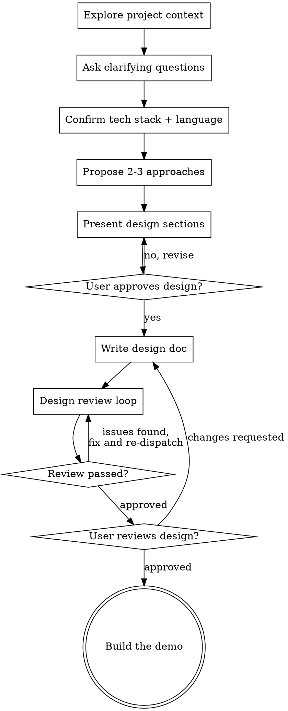

# Demo Planning: Ideas Into Demo Designs

Help turn a demo/prototype idea into a fully formed, structured design through natural collaborative dialogue.

Start by understanding the current project context, then ask questions one at a time to refine the idea. You MUST explicitly confirm the tech stack and language before presenting the design. Once you understand what you're building, present the design section by section and get user approval.

<HARD-GATE>
Do NOT write any code, scaffold any project, or take any implementation action until you have presented a design and the user has approved it. This applies to EVERY demo regardless of perceived simplicity.
</HARD-GATE>

## Anti-Pattern: "This Demo Is Too Simple To Need A Design"

Every demo goes through this process. A one-file script, a single API call, a UI mockup — all of them. "Simple" demos are where unexamined assumptions about inputs, outputs, and stack cause the most wasted work. The design can be short (a few sentences per section for truly simple demos), but you MUST present it and get approval.

## Checklist

You MUST create a task for each of these items and complete them in order:

1. **Explore project context** — check files, docs, recent commits
2. **Ask clarifying questions** — one at a time, cover purpose, inputs, outputs, and success criteria
3. **Confirm tech stack and language** — REQUIRED. Explicitly ask which language and stack/frameworks the demo must use (see Required Tech-Stack Questions below). Never assume.
4. **Propose 2-3 approaches** — with trade-offs and your recommendation
5. **Present design** — using the Design Document Template below, one section at a time, get user approval after each section
6. **Write design doc** — save to `docs/plans/YYYY-MM-DD-<topic>-design.md`
7. **Spec review loop** — dispatch demo-design-reviewer subagent with precisely crafted review context (never your session history); fix issues and re-dispatch until approved (max 5 iterations, then surface to human)
8. **User reviews written design** — ask user to review the design file before proceeding
9. **Transition to implementation** — proceed to build the demo only after approval

## Process Flow



## The Process

**Understanding the idea:**

- Check out the current project state first (files, docs, recent commits)
- Assess scope: if the request describes multiple independent pieces, flag it and help decompose before refining details. A demo should stay small and focused.
- Ask questions one at a time to refine the idea
- Prefer multiple choice questions when possible, but open-ended is fine too
- Only one question per message — if a topic needs more exploration, break it into multiple questions
- Focus on understanding: purpose, inputs, outputs, and success criteria

**Required Tech-Stack Questions (MUST ask before presenting the design):**

You MUST explicitly confirm these before moving on. Do NOT infer them from context or default to your own preferences.

- **Language** — Which programming language should the demo use? (offer likely options as multiple choice)
- **Tech stack / frameworks** — Which frameworks, libraries, runtime, or platform should it target? (e.g., web framework, CLI, notebook, cloud service)
- **Constraints** — Any required versions, existing dependencies, or environment limits?

If the user has no preference, propose a recommended stack with reasoning and get explicit confirmation before proceeding.

**Exploring approaches:**

- Propose 2-3 different approaches with trade-offs
- Present options conversationally with your recommendation and reasoning
- Lead with your recommended option and explain why

**Presenting the design:**

- Once you believe you understand what you're building, present the design using the Design Document Template below
- Present one section at a time, scaled to its complexity: a few sentences if straightforward, up to 200-300 words if nuanced
- Ask after each section whether it looks right so far
- Be ready to go back and clarify if something doesn't make sense

## Design Document Template

The demo design MUST cover exactly these sections, in this order:

```markdown
# <Demo Name> — Demo Design

Date: YYYY-MM-DD

## Purpose
Why this demo exists, what it demonstrates, and who it is for. Success criteria.

## Input
What the demo consumes: user actions, data, files, arguments, API inputs, or events. Include formats and sources.

## Output
What the demo produces: UI, console output, files, API responses, or side effects. Include formats and where output goes.

## Tech Stack
Language, frameworks, libraries, runtime/platform, and any version or dependency constraints. Confirmed with the user.

## Architecture
How the pieces fit together at a high level. Boundaries between units and how they communicate.

## Components
Each unit/module: what it does, how it is used, and what it depends on. Keep units small and single-purpose.

## Workflow
A detailed, high-level, step-by-step walkthrough of the logic — this is where the
Architecture is expanded into the actual process. For each step, explain WHAT happens
and WHY (the logic, decisions, and data transformations), in plain language, from input
through to output.

Rules for this section:
- Describe the LOGIC of each step, not the code structure.
- Do NOT reference specific function, method, or class names (e.g. no `parse_args()`,
  `main()`). Name the logical activity instead ("read the CLI arguments", "look up the
  product row").
- Keep it high level: a reader should understand the process without seeing the code.
- One numbered step per logical stage; expand the Architecture's boxes into prose.

## Limitations
The known problems, gaps, and trade-offs of THIS design/solution — stated honestly so the
reader understands what the demo does NOT solve. This comes after the Workflow because the
reader now understands how the solution works and can judge where it falls short.

Rules for this section:
- List concrete limitations, not generic caveats. Each should point at a real gap in
  scope, an assumption that may not hold, a shortcut taken for the demo, or an edge case
  left unhandled.
- For each limitation, briefly note WHY it exists (deliberate YAGNI cut, time/scope
  constraint, dependency limit) and, if relevant, what a production version would do
  instead.
- Cover at least: scope boundaries (what is intentionally out of scope), simplifying
  assumptions, scalability/performance ceilings, and any known correctness or robustness
  gaps.
- Keep it honest and specific — this section protects the reader from mistaking the demo
  for a complete solution.
```

Do NOT add Testing or Error Handling sections — a demo design intentionally omits them. If robustness matters, note it briefly inline under the relevant section rather than adding dedicated sections.

## After the Design

**Documentation:**

- Write the validated design to `docs/plans/YYYY-MM-DD-<topic>-design.md`
  - Replace `YYYY-MM-DD` with today's date and `<topic>` with a short kebab-case slug of the demo name
  - Create the `docs/plans/` directory if it does not exist
  - (User preferences for location override this default)

**Design Review Loop:**
After writing the design document:

1. Dispatch demo-design-reviewer subagent (see demo-design-reviewer-prompt.md)
2. If Issues Found: fix, re-dispatch, repeat until Approved
3. If loop exceeds 5 iterations, surface to human for guidance

**User Review Gate:**
After the review loop passes, ask the user to review the written design before proceeding:

> "Design written to `<path>`. Please review it and let me know if you want any changes before we start building the demo."

Wait for the user's response. If they request changes, make them and re-run the review loop. Only proceed once the user approves.

**Implementation:**

- Only after approval, build the demo following the confirmed tech stack and the Workflow section.

## Key Principles

- **One question at a time** — Don't overwhelm with multiple questions
- **Multiple choice preferred** — Easier to answer than open-ended when possible
- **Always confirm stack + language** — Never assume; ask explicitly before designing
- **YAGNI ruthlessly** — A demo shows one thing well; cut everything else
- **Explore alternatives** — Always propose 2-3 approaches before settling
- **Incremental validation** — Present design section by section, get approval before moving on
- **Be flexible** — Go back and clarify when something doesn't make sense
