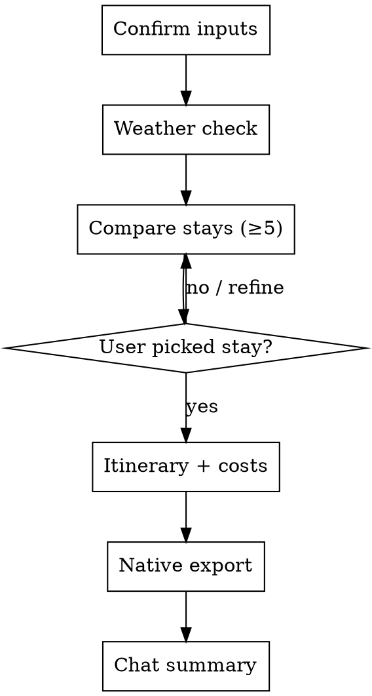

# Travel Planner

Turn a vague trip idea into a **complete plan you can book from**: confirmed requirements, weather check, compared stays, a chosen option, hour-by-hour itinerary, cost estimate, and a **four-sheet workbook** (Google Sheets or Excel depending on runtime).

The problem this solves is half-plans — a list of hotels with no itinerary, or a packed schedule with no budget reality. The deliverable is one spreadsheet plus a short chat summary the group can act on.

## When NOT to use this skill

- Visa, immigration, or travel insurance only
- Book one flight or one hotel with no broader plan
- One-off restaurant or café recommendation
- User already booked everything and only wants packing tips (answer inline; no full workflow)

For open-ended "where should I go?" research without dates or budget, prefer `researching`. Come back here once they have (or are ready to confirm) dates, headcount, and budget.

<HARD-GATE>
Do NOT build the detailed itinerary, finalize the budget, or export the workbook until:

1. **Required inputs are confirmed** — dates, budget per person, number of people, and either a destination or a shortlist the user agrees to compare.
2. **The user has picked one stay** (Step 4) — name it explicitly in chat before Step 5.

If the user is still browsing options or has not confirmed dates/budget, stop after Step 3 or 4.
</HARD-GATE>

## Checklist

Complete in order. Do not skip ahead past a gate.

1. **Confirm trip inputs** — destination or shortlist, dates, budget/person, headcount, group type, travel style, transport mode, dietary needs if relevant
2. **Weather & season** — web search; warn and offer backup if bad
3. **Search & compare stays** — at least 5 options (or 3 with documented search failure); read the right reference file first
4. **User selects one stay** — HARD-GATE; stop if not confirmed
5. **Build itinerary** — departure through return, with rain backup
6. **Cost estimate** — categories + 10–15% buffer; flag if over budget
7. **Export workbook (native)** — detect runtime; use platform spreadsheet tool (see `references/export-by-runtime.md`)
8. **Summarize in chat** — highlights, cost/person, warnings, link to Sheets or `.xlsx`

## Process flow



## Reference files — read before searching

| Trip type | Read first |
|-----------|------------|
| Vietnam domestic | `references/domestic-vn.md` |
| Outside Vietnam | `references/international.md` |
| Data & sheet layout | `references/output-schema.md` |
| Export by runtime | `references/export-by-runtime.md` |

Do not load both domestic and international references unless the user is genuinely comparing cross-border options.

---

## Step 1: Confirm trip inputs

Gather what is missing **one topic at a time** when the user's first message is incomplete. Priority order:

1. **Destination** — specific place, region, or "no idea yet" (then suggest 3–5 fits from budget/style/dates)
2. **Dates** — leave/return, number of nights
3. **Budget per person** — accommodation only vs all-inclusive trip budget
4. **Travel style** — resort, onsen, villa, homestay, glamping, nature, city…
5. **Headcount & group** — couples, family with kids, friends, team building
6. **Transport** — self-drive, bus/train, flight, hire car (affects cost and itinerary)
7. **Dietary restrictions** — if you will suggest restaurants

If the first message already has enough to proceed, summarize back for confirmation and continue.

**Required before Step 2:** dates, budget/person, `num_people`, and destination or agreed shortlist.

---

## Step 2: Weather & season

Use **WebSearch** for `"weather [destination] [month/year]"` or the specific dates.

Include: typical conditions, rain/storm risk, peak season pricing, anything that changes outdoor plans.

If weather is poor, say so and offer: different dates, backup destination, or indoor/rain Plan B before lodging search.

---

## Step 3: Search & compare stays

Use **WebSearch** and **WebFetch** on booking pages when useful. Follow the platform list in the reference file for the trip region.

**Output:** at least **5** options (3 minimum only if you document exhausted search — widen budget ±20% or area first).

For each option use this table (see `references/output-schema.md` for column rules):

| Field | Content |
|-------|---------|
| Name & type | Resort / villa / homestay / … |
| Price/night | Amount + currency + source + "reference price as of [date]" |
| Rating | Score + review count |
| Distance | From user's departure city/point |
| Pros | 3–4 bullets |
| Cons | 2–3 bullets |
| Booking link | URL |
| Best for | Couples / family / friends / … |

Cross-check price on more than one platform when possible. Cross-check reviews (Maps + booking site).

---

## Step 4: User picks one stay

Present a comparison summary and ask which option to plan around.

If unhappy: search more, adjust budget, area, or style — then re-present. **Do not continue until one stay is named.**

---

## Step 5: Itinerary

Cover **departure through return** in time blocks:

- Morning (06:00–11:00)
- Midday (11:00–14:00)
- Afternoon (14:00–18:00)
- Evening (18:00–22:00)

Include: restaurants with rough prices, activities matching style, transit time between stops, rain backup.

Keep density reasonable — families, seniors, and young kids need slack.

---

## Step 6: Cost estimate

Categories:

1. **Lodging** — nightly rate × nights (note shared vs per-room split)
2. **Transport** — fuel, tolls, grab/taxi, parking, flights, trains
3. **Food** — ~3 meals/day × people × days (adjust for style)
4. **Activities** — tickets, spa, rentals
5. **Buffer** — 10–15% contingency

If total per person exceeds budget by >30%, warn clearly and offer cuts (cheaper stay vs fewer activities).

Build the `costs` array for the schema in `references/output-schema.md`.

---

## Step 7: Export workbook (native — no bundled scripts)

**Read `references/export-by-runtime.md` first.** Do not run Python scripts from this skill folder.

1. **Detect runtime** — Gemini Spark, Claude, or Amazon Quick (see export reference).
2. **Assemble plan data** per `references/output-schema.md` (optional `plan.json` in workspace).
3. **Export with the platform's native tool:**
   - **Gemini Spark** → Google Sheets (4 tabs via Connected App)
   - **Claude** → `.xlsx` via xlsx skill / code execution (openpyxl in sandbox)
   - **Amazon Quick** → `.xlsx` via document creation or Excel extension
4. **Verify** all four sheets: **Tổng quan**, **Lịch trình**, **Dự toán chi phí**, **Checklist**.

Never hand-type a loose markdown table as the final deliverable when native export is available.

---

## Step 8: Chat summary

```markdown
## [Destination] — [dates]

**Chỗ nghỉ:** [name] — [link]
**Chi phí dự kiến:** [X]/người (đã gồm buffer [%])
**Thời tiết:** [one line]

### Highlights
- [day 1 highlight]
- [day 2 highlight]

### Lưu ý
- [booking deadline, cancellation, what to bring, price disclaimer]

📎 [Google Sheets link] hoặc `travel-plan.xlsx`
```

Ask if they want changes. Iterate from the step that needs updating.

---

## Example

**User:** "6 người đi Tam Đảo thứ 7-CN, budget 2 triệu/người, muốn villa có bể bơi"

**After Step 3 (abbreviated):**

| | Villa A | Villa B |
|--|---------|---------|
| Giá/đêm | 3.2M (Agoda) | 2.8M (Airbnb) |
| Rating | 4.6 (89) | 4.4 (210) |
| Phù hợp | Nhóm lớn, bể riêng | Gần trung tâm, giá tốt |

**After Step 8:** summary block + four-sheet workbook (Sheets link or `.xlsx`).

---

## Lessons learned

### Do

- Check weather before recommending outdoor-heavy plans
- Compare cross-platform prices — same room can differ 20–30%
- Include transport (tolls, fuel, grab) — often 10–20% of budget
- Add 10–15% buffer; label prices as reference with date + link
- Prefer free-cancellation stays when dates are uncertain
- Ask dietary needs when suggesting restaurants
- Use native export per runtime — same sheet names everywhere

### Don't

- Offer options >30% over budget without a clear warning
- Trust a single review source
- Pack the schedule — especially with kids or older travelers
- Skip transport mode — it changes both cost and timeline
- Run bundled Python scripts when the platform has spreadsheet tools

### Common failures

| Issue | Response |
|-------|----------|
| Stale or missing prices | State "giá tham khảo tại [ngày]" + booking link |
| Sold out weekends | Book early or shift to weekdays |
| Closed or renamed property | Check review dates; verify on Maps |
| Export tool unavailable | Tell user which runtime is needed; offer markdown summary as interim |

### When to ask

- Budget too low for requirements — what to cut: lodging vs activities
- Two options tied — present trade-offs, ask priority
- Bad weather — change dates vs keep + indoor plan
- Special group (infant, pet, accessibility) — gather constraints first
