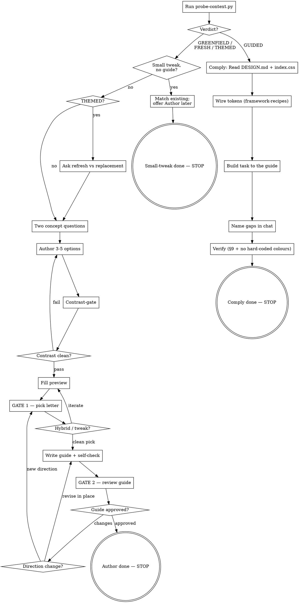

# UI Style Guide: One Direction, Recorded Once

Turn "make it look good" into a **design contract**: picked direction, real tokens, and rules in `docs/DESIGN.md` + `docs/index.css` so later UI tasks build the same product — not a new look each session.

## Two Modes - Resolve This First

| The probe says | Mode | You do | Ends with |
|---|---|---|---|
| `GUIDED` | **Comply** | Follow Process Flow / Comply steps — decide nothing the guide already decided | UI change + gaps named in chat |
| `GREENFIELD` / `FRESH` / `THEMED` | **Author** | Follow Process Flow / Author checklist | User approving the guide. **No app code.** |

**Probe first** — before answering anything:

```bash
python "<skill-dir>/scripts/probe-context.py"
```

Verdict picks the branch below. Do not guess mode from the user's phrasing.

### When Author is the wrong answer

`FRESH` + a **small** UI ask ("loading spinner", "fix padding") → match existing components; offer Author for later:

> "There's no design guide yet, so I'll match existing components for now. Say the word and I'll run the option pick for a `docs/DESIGN.md`."

Author is for when visual identity is the subject: new project, redesign, theme, design system, or chronic inconsistency.

## Process Flow



**Terminal:** Author = guide approved, no app code. Comply = UI verified. Small-tweak = matched + Author offered. Never scaffold in Author.

**Probe gaps you own:** read listed screens for conventions → guide Layout; on `THEMED` ask refresh (keep names/structure, change values) vs replacement (new direction); report `CONFLICTS` in one line + guide header — do not chase version confirmation.

---

# Mode: Comply

1. **Read** `docs/DESIGN.md` + `docs/index.css` in full (anti-patterns at the bottom).
2. **Wire tokens** into the app stylesheet first (comment-free). Read stack from `package.json` — never ask — then `framework-recipes.md`. Tailwind v4: `@theme inline` for every colour var; v3: `theme.extend`. Skipping fails silently. Check one utility renders before building.
3. **Build** to the guide: tokens, surface kit, motion, recipes, both modes. **Inside §5 app shell** — no private max-width / second sidebar / second nav.
4. **Gaps:** smallest choice consistent with §1; **say it in chat**.
5. **Verify** with §9 commands; grep `#` and `rgb(` in components.

**Never:** re-interview / re-author / preview; "improve" the direction; silent guide edits (`DESIGN-v2.md` forbidden — revise in place after a yes); §7 in the wrong engine's syntax.

Explicit "redo the whole look" on `GUIDED` → confirm replacement → Author, rewrite guide in place.

---

# Mode: Author

Direction pick, not a palette dump. **Divergence:** each option shippable alone; not three tints of one idea. Deliverable is the guide — not app code, not `npm install`, not the app's `index.css`.

<HARD-GATE>
**Gate 1.** Do not write the guide until the user picks a letter (or named hybrid).

**No stack questions.** Plain custom properties; §7 = tokens/states. Detected stack → guide header only. Wiring = Comply step 2.

**Gate 2.** After writing: path, what it commits to, ask them to read. **End the turn.** Greenfield files only under `<project>/docs/`.
</HARD-GATE>

**Anti-patterns:** default zinc; font-you-always-pick; hue-only "choices"; interviewing fonts/radius/density/mood; asking Q2 twice; adjective-only guide rules.

## Checklist

1. **Probe** — on `THEMED` ask refresh vs replacement; on `GREENFIELD` only `mkdir -p ./<project-slug>/docs`.
2. **Two concept questions** — product, then colour *or* inspiration. Nothing else.
3. **Author 3–5 options** — read `references/concept-dials.md` then `references/option-authoring.md` (+ `shadcn-tokens.md` as needed).
4. **Contrast-gate** — zero failures before preview.
5. **Fill preview** — sharpen axes; cut shared kits/names.
6. **GATE 1** — tradeoff table; wait for a letter.
7. **Write** `docs/index.css` + `docs/DESIGN.md` — `make-guide.py` + `guide-template.md`; run the self-check below. §7 stays tokens/states.
8. **GATE 2** — ask them to read especially §5 and §8. End turn.

## Greenfield layout

```
<project-slug>/docs/
├── DESIGN.md
├── index.css
└── design/
    ├── ui-options.html
    └── option-tokens/
        ├── manifest.json
        └── {A,B,...}-<name>.css
```

cwd root, never under `.claude/`. No `package.json`, no `src/`. Header: "Stack: not chosen yet".

## Concept Questions

One at a time. Only these change what gets authored.

1. **What is this product, and who uses it?** → density, accent, **archetype** (see `references/concept-dials.md`).
2. **Anchor — pick one:**
   - **Brand colour** — hex/logo; **pin `primary` in every option**.
   - **Inspiration site** — link(s) + what they like; **fetch each**; ≥1 option answers it, ≥1 does not; record in `manifest.json` `inspiration`.
   - **Neither** — colour per direction.

Do not ask colour then separately ask for a site. Do **not** ask: fonts, radius, density, spacing, mood, style names, light/dark, components, stack. Volunteered constraints — take them; no follow-up interview.

## Authoring (invariants)

- Each option needs a distinct **axis** before tokens. Hue-only = one direction — cut.
- Vocabulary: shadcn names, **hex**, full light+dark, seven `--surface-*` + kit name. Details/templates: `references/option-authoring.md`.
- Dark is **authored**, not inverted.
- Avoid AI-default looks (purple gradients; cream+terracotta serif; broadsheet hairlines).

```bash
# contrast — all options
for f in <project-slug>/docs/design/option-tokens/*.css; do
  node "<skill-dir>/scripts/contrast-check.mjs" "$f" || echo "FAILED: $f"
done

# preview
python "<skill-dir>/scripts/fill-preview.py" \
  <project-slug>/docs/design/option-tokens/manifest.json \
  --out <project-slug>/docs/design/ui-options.html
```

Existing project: write under repo-root `docs/design/` (no slug). Present tradeoff table; never pre-pick. Hybrids → `ui-options-v2.html`, then clean pick.

> "Directions are in `…/ui-options.html` — tabs + `d` for dark. Which letter (or hybrid)?"

## Writing the Guide

```bash
python "<skill-dir>/scripts/make-guide.py" \
  <project-slug>/docs/design/option-tokens/<LETTER>-<name>.css \
  --css-out <project-slug>/docs/index.css
node "<skill-dir>/scripts/contrast-check.mjs" <project-slug>/docs/index.css
```

From `references/guide-template.md`. Judgement-heavy: §1, §5, §7, §8. **§5 app shell required** (archetype + probe screens). Rules need values, not adjectives. No scope table / impl step list. ~150–250 lines. No comments in `docs/index.css`.

**Self-check before Gate 2** (fix in place; do not dispatch a reviewer subagent):

- No unfilled `<...>` placeholders
- No adjective-only rules — every rule names a token, number, or concrete treatment
- Every hex in §2 matches `docs/index.css`
- Zero `/*` comments in `docs/index.css`
- §7 is token-and-state only — no framework class names / `bg-*` / `className`
- §5 has a real app shell (region sizes, where new work goes, what a screen must reuse)
- If a brand hex was given, light-mode `--primary` is exactly that hex

**Gate 2:** path + commitments; read §5/§8. Revisions in place. Change request ≠ approval. New direction → Gate 1. No scaffolding this turn.

## Red Flags - STOP

- Scaffold / `npm install` / app `index.css` in Author; re-author on `GUIDED`; `DESIGN-v2.md`
- Guide before letter pick; preview before clean contrast; hue-only / same-kit set
- Asking stack / fonts / radius / density / mood; Q2 twice; unfetched inspiration; invented brand hex
- Chatbot as `dashboard`; `THEMED` without refresh vs replacement
- Adjective-only rules; unfilled `<...>`; token dump in guide; comments in `index.css`; §7 framework classes
- Comply "improving" the look; ending Author without asking them to read the guide
- Pick + "go build it" → still write/show guide first (build = later Comply)
- Offline/privacy → system fonts, no CDN in preview and guide §3

## Supporting Files

Read **on demand** — never all up front:

| File | When |
|---|---|
| `references/concept-dials.md` | After Q1, before options |
| `references/option-authoring.md` | Author steps 3–5 |
| `shadcn-tokens.md` | Authoring tokens / surface kit |
| `references/guide-template.md` | Writing the guide |
| `framework-recipes.md` | **Comply step 2 only** |
| `references/quick-reference.md` | Guide §5–8 (section, not whole file) |

Run, don't read: `scripts/probe-context.py` · `fill-preview.py` · `make-guide.py` · `contrast-check.mjs` · `mockup-template.html`
